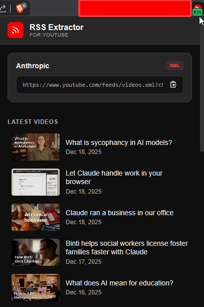

# YouTube RSS Extractor

A Chrome extension that extracts RSS feed URLs from YouTube channels and videos. Subscribe to your favorite creators in any RSS reader.


## Features

- Extract RSS feed URL from any YouTube channel or video page
- One-click copy to clipboard
- Preview latest videos directly in the popup
- Works on channel pages, video pages, and Shorts
- Minimal permissions (only accesses youtube.com)
- No data collection or external requests (except to YouTube's RSS feed)

## Installation

### From Source (Developer Mode)

1. Download or clone this repository
2. Open Chrome and navigate to `chrome://extensions/`
3. Enable **Developer mode** (toggle in top right)
4. Click **Load unpacked**
5. Select the extension directory

### Usage

1. Navigate to any YouTube channel or video page
2. Click the extension icon in your toolbar
3. The RSS feed URL will be displayed
4. Click the copy button to copy the URL
5. Paste into your RSS reader (Feedly, Inoreader, NewsBlur, etc.)

## Screenshots

| Popup with RSS Feed | Badge Indicator |
|---------------------|-----------------|
|  |  |

> To add screenshots: Take screenshots of the extension in action and save them to the `screenshots/` directory.

## How It Works

The extension uses multiple strategies to detect the channel ID:

1. **DOM Elements** - Parses video owner links and channel headers
2. **RSS Meta Tags** - Reads `<link rel="alternate" type="application/rss+xml">` on channel pages
3. **Script Data** - Falls back to searching YouTube's initial data scripts

Once the channel ID is found, it constructs the RSS URL:
```
https://www.youtube.com/feeds/videos.xml?channel_id=UC...
```

## Development

### Project Structure

```
youtube-rss-extractor/
├── manifest.json      # Extension configuration (Manifest V3)
├── background.js      # Service worker for badge updates
├── content.js         # Content script for channel detection
├── popup.js           # Popup UI logic
├── index.html         # Popup markup
├── styles.css         # Popup styling
└── icons/             # Extension icons
```

### Architecture

```
┌─────────────────┐     ┌─────────────────┐     ┌─────────────────┐
│  background.js  │────▶│   content.js    │◀────│    popup.js     │
│ (service worker)│     │ (YouTube page)  │     │  (extension UI) │
└─────────────────┘     └─────────────────┘     └─────────────────┘
        │                        │                       │
        ▼                        ▼                       ▼
   Badge update           Channel detection        RSS display
```

### Message Flow

1. User navigates to YouTube → `background.js` detects URL change
2. `background.js` sends `CHECK_AVAILABILITY` to `content.js`
3. `content.js` scans page for channel ID, returns availability
4. If found, badge shows "RSS" indicator
5. User clicks extension → `popup.js` sends `GET_CHANNEL_DETAILS`
6. `content.js` returns channel ID, name, and RSS URL
7. `popup.js` fetches RSS feed and displays recent videos

### Building

No build step required. The extension runs directly from source files.

To test changes:
1. Make your edits
2. Go to `chrome://extensions/`
3. Click the refresh icon on the extension card

### Contributing

1. Fork the repository
2. Create a feature branch (`git checkout -b feature/my-feature`)
3. Commit your changes (`git commit -m 'Add my feature'`)
4. Push to the branch (`git push origin feature/my-feature`)
5. Open a Pull Request

## Privacy

This extension:
- Only activates on youtube.com pages
- Does not collect any user data
- Does not make requests to any third-party servers
- Only fetches YouTube's public RSS feeds (when you open the popup)

## License

MIT License - see [LICENSE](LICENSE) for details.
